# AI-102 Reference Architectures

> Key architectural patterns for the Microsoft AI-102 exam.
> Each section includes a Mermaid diagram, component breakdown, and exam-relevant notes.

---

## 1. RAG (Retrieval Augmented Generation) Architecture

Retrieval Augmented Generation grounds LLM responses in your own data, reducing hallucinations and enabling domain-specific answers without fine-tuning.

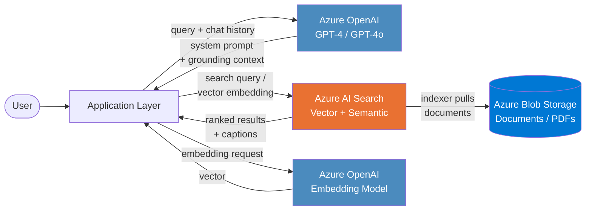

### How It Works

1. User submits a question via the application.
2. The app generates a vector embedding of the query using an Azure OpenAI embedding model.
3. Azure AI Search performs **hybrid retrieval** (vector similarity + keyword BM25) with optional **semantic ranking**.
4. Top-ranked document chunks are injected into the **system prompt** as grounding context.
5. Azure OpenAI generates a response constrained to the retrieved context.

### Key Components

| Component | Purpose |
|---|---|
| **Azure OpenAI (Chat)** | Generates natural language answers grounded in context |
| **Azure OpenAI (Embedding)** | Converts queries and documents into vectors (text-embedding-ada-002 / text-embedding-3-large) |
| **Azure AI Search** | Stores vectors and text; performs hybrid + semantic retrieval |
| **Blob Storage** | Source document store (PDF, DOCX, HTML, etc.) |
| **Integrated Vectorization** | Search-managed chunking and embedding at index time |

### Key Exam Points

- **"On Your Data"** feature in Azure OpenAI connects directly to AI Search — no custom code needed for basic RAG.
- Hybrid search (vector + keyword) with semantic ranker provides the best relevance.
- `role: "system"` messages carry the grounding context; `role: "user"` carries the question.
- **Temperature = 0** is recommended for factual/grounded responses.
- Chunking strategy (size, overlap) directly impacts retrieval quality.
- Citations can be returned by instructing the model to reference `[docN]` source IDs.

### Exam Objectives

- *Plan and manage an Azure AI solution* — selecting appropriate services for RAG
- *Implement Azure AI Search solutions* — indexing, querying, vectorization
- *Create solutions with Azure OpenAI* — completions API, system messages, grounding

### Relevant Labs

- Lab: Implement RAG with Azure OpenAI and Azure AI Search
- Lab: Use your own data with Azure OpenAI

---

## 2. Azure AI Search Enrichment Pipeline

The AI enrichment pipeline transforms raw, unstructured content into searchable, structured data by applying cognitive skills during indexing.

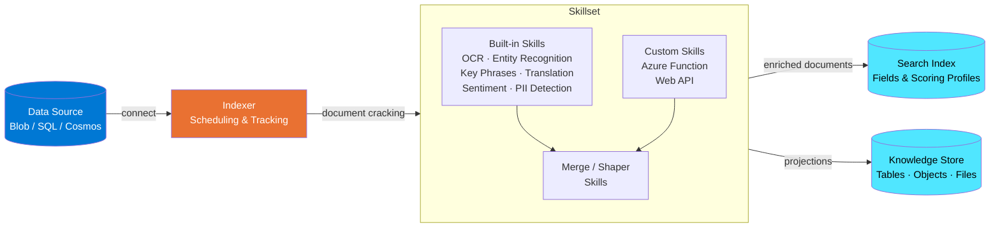

### How It Works

1. A **data source** connection points the indexer to raw content (Blob, SQL, Cosmos DB, etc.).
2. The **indexer** cracks documents (extracts text/images), tracks change detection, and orchestrates the pipeline.
3. The **skillset** applies a chain of AI transformations (built-in or custom) to each document.
4. Enriched output is mapped to **index fields** via `outputFieldMappings`.
5. Optionally, enriched data is projected into a **knowledge store** for downstream analytics.

### Built-in vs Custom Skills

| Built-in Skills | Custom Skills |
|---|---|
| OCR, Image Analysis, Entity Recognition, Key Phrase Extraction, Language Detection, Translation, Sentiment, PII Detection, Text Split | Any logic hosted as an **Azure Function** or **Web API** conforming to the custom skill interface |
| No additional deployment needed | Requires implementing the `WebApiSkill` JSON contract (records in → records out) |
| Billed per AI Services transaction | Billed per Function execution + AI Services if used internally |

### Knowledge Store Projections

| Projection Type | Storage Target | Use Case |
|---|---|---|
| **Table** | Azure Table Storage | Structured analytics, Power BI |
| **Object** | Azure Blob Storage (JSON) | Full enrichment tree for downstream apps |
| **File** | Azure Blob Storage (binary) | Normalized images extracted via OCR |

### Key Exam Points

- A skillset must be attached to an **AI Services multi-service resource** (not a free tier) for production workloads.
- Custom skills use the `WebApiSkill` type; the function must accept and return the standard `{ "values": [...] }` JSON format.
- The **Shaper skill** creates complex types for knowledge store projections.
- `fieldMappings` map source fields → index; `outputFieldMappings` map enrichment output → index.
- Incremental enrichment caches skill output to avoid reprocessing unchanged documents.
- **Debug sessions** in the portal allow step-through inspection of the enrichment pipeline.

### Exam Objectives

- *Implement knowledge mining and document intelligence solutions* — skillsets, indexers, knowledge store
- *Implement Azure AI Search solutions* — index schema, field mappings, custom skills

### Relevant Labs

- Lab: Create an Azure AI Search solution
- Lab: Create a custom skill for Azure AI Search
- Lab: Create a knowledge store with Azure AI Search

---

## 3. Document Processing Pipeline

Azure AI Document Intelligence extracts structured data from documents at scale, feeding downstream search and application layers.

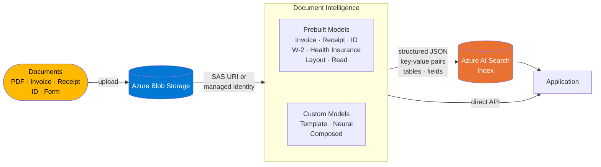

### Prebuilt vs Custom Model Decision

| Factor | Prebuilt | Custom (Template) | Custom (Neural) |
|---|---|---|---|
| **When to use** | Standard document types (invoices, receipts, IDs) | Fixed-layout forms unique to your org | Variable-layout forms |
| **Training data** | None required | ≥ 5 labeled samples | ≥ 5 labeled samples |
| **Layout sensitivity** | N/A | Exact layout match needed | Handles layout variation |
| **Composed model** | N/A | ✅ Combine up to 200 models | ✅ Can be composed |

### Composed Models

- A **composed model** routes incoming documents to the appropriate sub-model automatically.
- Use `docType` confidence to determine which sub-model matched.
- Maximum of **200** component models per composed model.

### Key Exam Points

- **Read model** → plain text + handwriting; **Layout model** → text + tables + structure; **Prebuilt** → specific document types with named fields.
- Custom template models require documents with **consistent layout** (same form version).
- Custom neural models handle **varying layouts** and are more flexible but take longer to train.
- Document Intelligence Studio provides labeling UI for training custom models.
- API versions: use `2024-11-30` (GA) or later for latest features.
- Results include `confidence` scores — exam may test threshold decisions.

### Exam Objectives

- *Implement knowledge mining and document intelligence solutions* — model selection, training, composed models
- *Implement Azure AI Search solutions* — using Document Intelligence as a data source or custom skill

### Relevant Labs

- Lab: Extract data from forms with Azure AI Document Intelligence
- Lab: Create a composed Document Intelligence model

---

## 4. Computer Vision Pipeline

Azure AI Vision services analyze images and video for classification, detection, OCR, and rich media indexing.

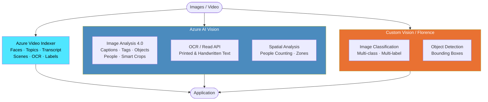

### Service Selection Guide

| Need | Service | Key Feature |
|---|---|---|
| General image analysis | **AI Vision — Image Analysis** | Captions, tags, objects, people, colors |
| Read text from images | **AI Vision — Read / OCR** | Async batch or sync single-page |
| Domain-specific classification | **Custom Vision** or **Florence fine-tuning** | Train with your own labeled images |
| Object detection with bounding boxes | **Custom Vision** or **Image Analysis** (custom model) | Locate specific objects |
| Video content understanding | **Azure Video Indexer** | Transcripts, faces, topics, scenes, brands |
| Spatial / in-store analytics | **AI Vision — Spatial Analysis** | Edge container, zone counting |

### Key Exam Points

- Image Analysis 4.0 uses **Florence** foundation model — supports both prebuilt and custom training via few-shot.
- **Read API** is the recommended OCR approach (replaces older Computer Vision OCR endpoints).
- Custom Vision supports **export to ONNX, TensorFlow, CoreML** for edge/offline scenarios.
- Custom Vision training: **Quick Training** (fast, fewer iterations) vs **Advanced Training** (specify budget in hours).
- Custom Vision has two project types: **Classification** (multi-class or multi-label) and **Object Detection**.
- Video Indexer supports **custom language models**, **custom brands models**, and **custom person models**.
- **Multi-modal embeddings** (vectorize images + text into the same space) enable image retrieval via text queries.

### Exam Objectives

- *Implement computer vision solutions* — Image Analysis, OCR, Custom Vision
- *Implement Azure AI Search solutions* — using vision skills in enrichment pipeline
- *Create solutions with Azure AI Video Indexer*

### Relevant Labs

- Lab: Analyze images with Azure AI Vision
- Lab: Read text with Azure AI Vision
- Lab: Classify images with Custom Vision
- Lab: Detect objects with Custom Vision
- Lab: Analyze video with Video Indexer

---

## 5. Speech Application Architecture

Azure AI Speech services enable real-time and batch speech processing, translation, and natural-sounding synthesis.

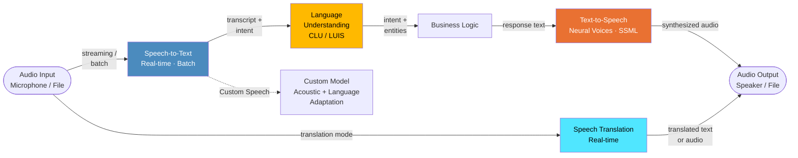

### Key Components

| Component | Purpose |
|---|---|
| **Speech-to-Text** | Convert audio to text; supports real-time streaming and batch transcription |
| **Text-to-Speech** | Generate speech from text; neural voices with SSML for prosody control |
| **Speech Translation** | Real-time speech-to-speech or speech-to-text translation |
| **Custom Speech** | Adapt acoustic/language models with your own data for domain-specific recognition |
| **Custom Neural Voice** | Create a branded voice with ≤ 1 hour of training audio (requires approval) |
| **Intent Recognition** | Direct integration of Speech SDK with CLU for single-step speech-to-intent |

### SSML (Speech Synthesis Markup Language)

```xml
<speak version="1.0" xmlns="http://www.w3.org/2001/10/synthesis"
       xmlns:mstts="http://www.w3.org/2001/mstts" xml:lang="en-US">
  <voice name="en-US-JennyNeural">
    <mstts:express-as style="cheerful" styledegree="1.5">
      Welcome to the demo!
    </mstts:express-as>
    <break time="500ms"/>
    <prosody rate="-10%" pitch="+5%">
      Let me show you the features.
    </prosody>
  </voice>
</speak>
```

### Key Exam Points

- **SpeechConfig** + **AudioConfig** are the two required objects for any Speech SDK operation.
- `SpeechRecognizer.recognized` event fires after final recognition; `recognizing` fires for interim results.
- Batch transcription uses a REST API (not the SDK) and requires audio in Blob Storage.
- Speech Translation `TranslationRecognizer` can output to multiple target languages simultaneously.
- Custom Speech models improve accuracy for domain-specific vocabulary, accents, and noisy environments.
- SSML controls: `<voice>`, `<prosody>` (rate, pitch, volume), `<break>`, `<mstts:express-as>` (style), `<say-as>` (interpret-as).
- **Pronunciation Assessment** evaluates accuracy, fluency, completeness, and prosody.

### Exam Objectives

- *Implement natural language processing solutions* — speech recognition, synthesis, translation
- *Create solutions with Azure OpenAI* — integrating speech with GPT for voice assistants

### Relevant Labs

- Lab: Recognize and synthesize speech
- Lab: Translate speech
- Lab: Create a custom speech model (if available in course)

---

## 6. Conversational AI Architecture

Azure Bot Framework combined with Conversational Language Understanding (CLU) and custom question answering enables intelligent, multi-turn conversational experiences.

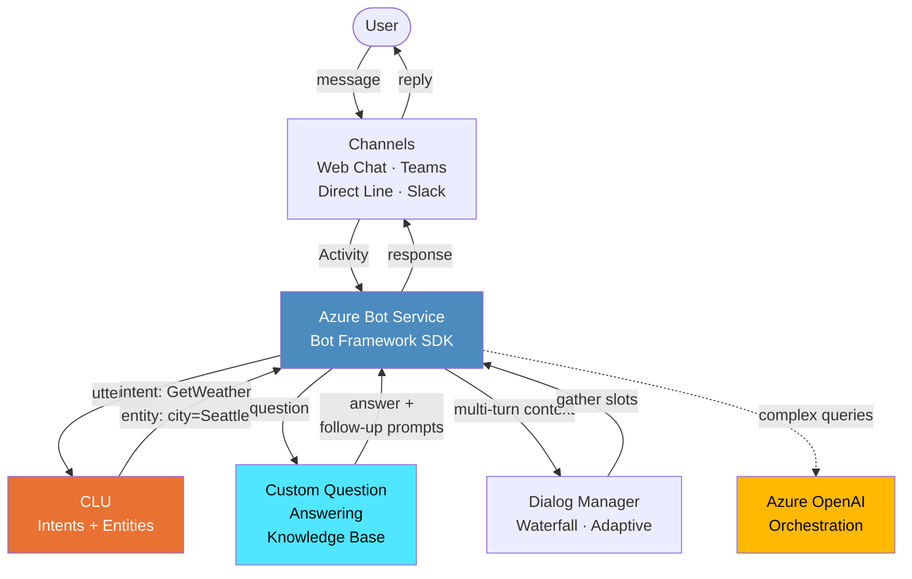

### Multi-Turn Conversation Flow

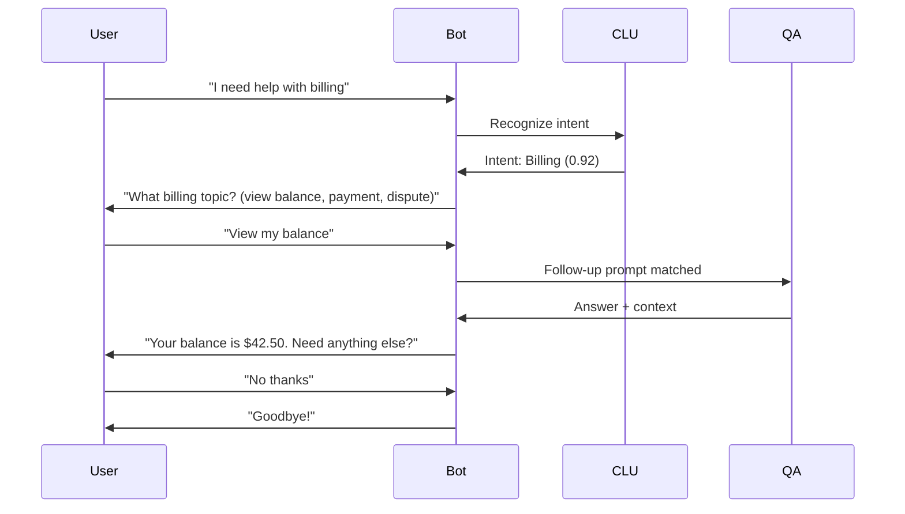

### Key Components

| Component | Purpose |
|---|---|
| **CLU (Conversational Language Understanding)** | Intent classification and entity extraction — replaces LUIS |
| **Custom Question Answering** | FAQ-style Q&A from documents, URLs, or manual entries — replaces QnA Maker |
| **Bot Framework SDK** | Conversation management, dialog flows, state management |
| **Azure Bot Service** | Hosting, channel registration, authentication |
| **Adaptive Dialogs** | Declarative, event-driven dialog management |

### Key Exam Points

- **CLU** is the successor to LUIS; both may appear on the exam but CLU is the current recommendation.
- CLU is authored in **Language Studio** and deployed to a **Language resource** prediction endpoint.
- Custom Question Answering uses **precise answering** (short answer extraction) and **follow-up prompts** for multi-turn.
- Confidence threshold: default is 0.5; adjust to control answer precision vs recall.
- **Orchestration workflow** in CLU can route between CLU projects and QA projects in a single call.
- Bot state: **UserState** (persists across conversations), **ConversationState** (single conversation), **PrivateConversationState** (per user per conversation).
- `Activity.type` — "message", "conversationUpdate", "event", etc. The `OnMembersAdded` handler sends welcome messages.
- Active learning in QA suggests alternate questions based on user traffic.

### Exam Objectives

- *Implement natural language processing solutions* — CLU, question answering, orchestration
- *Create conversational AI solutions* — Bot Framework, dialogs, state management

### Relevant Labs

- Lab: Create a question answering solution
- Lab: Create a conversational language understanding model
- Lab: Create a bot with the Bot Framework SDK
- Lab: Create a Bot Framework Composer bot (if included)

---

## 7. AI Foundry (Microsoft Foundry) Project Architecture

Azure AI Foundry (formerly Azure AI Studio) provides a unified platform for building, evaluating, and deploying generative AI solutions.

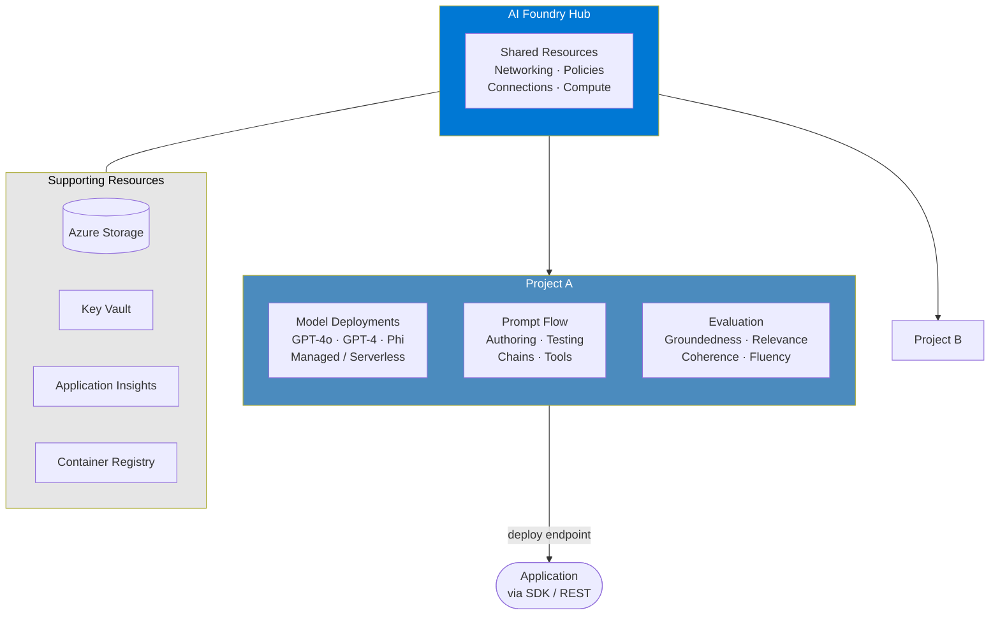

### Hub vs Project

| Concept | Scope | Purpose |
|---|---|---|
| **Hub** | Organization-level | Shared connections, networking, policies, compute pools |
| **Project** | Team / app-level | Model deployments, prompt flows, evaluations, data, experiments |

### Prompt Flow

- Visual DAG editor for building LLM chains (prompt → LLM → output).
- Node types: **LLM**, **Python**, **Prompt**, **Tool** (search, DALL-E, etc.).
- Supports **batch runs** for evaluation over test datasets.
- Deploy as a **managed online endpoint** for production serving.

### Key Exam Points

- Each **hub** has exactly one associated Azure AI Services multi-service resource.
- Projects inherit hub connections but can add project-specific connections.
- **Model catalog** offers Azure OpenAI models, open-source models (Llama, Mistral), and model-as-a-service (MaaS) via serverless API.
- **Managed compute** deployments bill by token usage; **serverless API** deployments bill per transaction.
- Evaluation metrics: **groundedness**, **relevance**, **coherence**, **fluency**, **similarity**, **F1**.
- Content safety evaluations run automatically during model evaluation.
- Prompt flow supports **connection** objects for API keys / endpoints — secrets stored in Key Vault.
- **Tracing** with Application Insights provides end-to-end observability of prompt flow runs.

### Exam Objectives

- *Plan and manage an Azure AI solution* — hub/project structure, resource management
- *Create solutions with Azure OpenAI* — model deployment, evaluation, prompt engineering
- *Implement generative AI solutions* — prompt flow, RAG orchestration

### Relevant Labs

- Lab: Explore Azure AI Foundry
- Lab: Create a prompt flow in Azure AI Foundry
- Lab: Evaluate generative AI models

---

## 8. Agentic AI Architecture

Agentic AI uses autonomous agents that can plan, use tools, and complete multi-step tasks — powered by the Azure OpenAI Assistants API or Semantic Kernel.

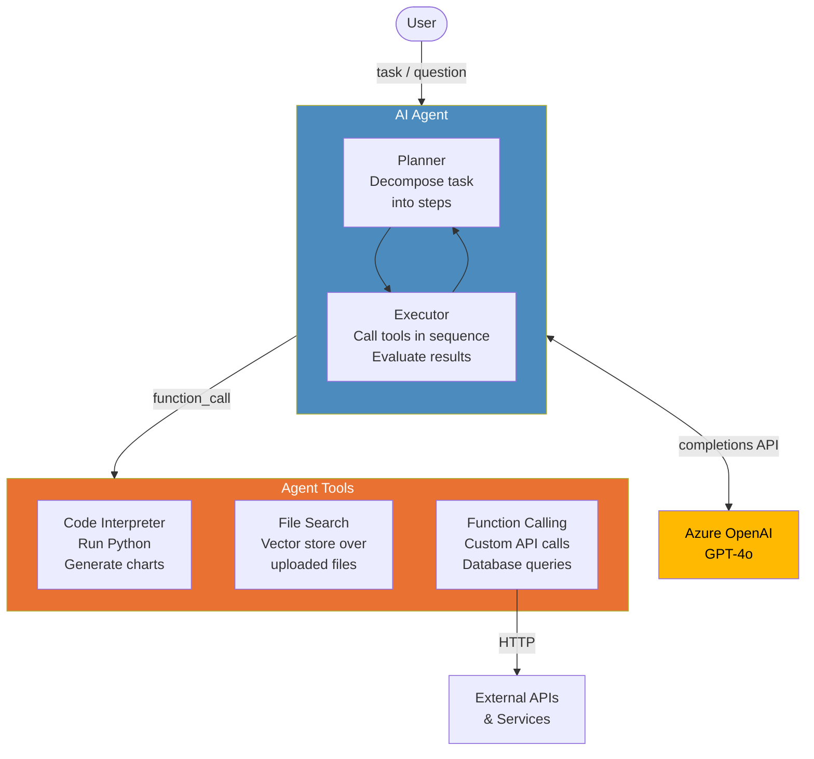

### Multi-Agent Orchestration

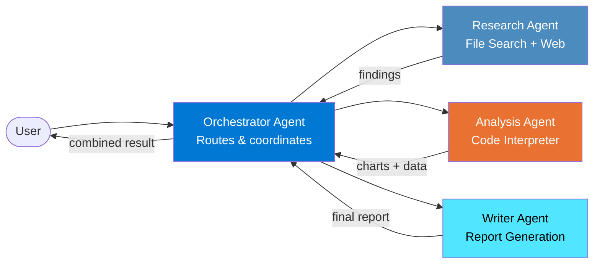

### Key Components

| Component | Purpose |
|---|---|
| **Assistants API** | Manages threads, runs, and tool execution for stateful agents |
| **Code Interpreter** | Sandboxed Python execution for math, data analysis, chart generation |
| **File Search** | Built-in RAG over uploaded files (auto-chunks, embeds, and retrieves) |
| **Function Calling** | Agent invokes developer-defined functions; app executes and returns results |
| **Threads** | Persistent conversation state with automatic context window management |

### Key Exam Points

- **Assistants API** objects: `Assistant` → `Thread` → `Message` → `Run` → `RunStep`.
- A **Run** can have status: `queued`, `in_progress`, `requires_action` (function call), `completed`, `failed`.
- When status is `requires_action`, the app must execute the function and submit tool outputs via `submit_tool_outputs`.
- **Code Interpreter** supports file uploads (CSV, XLSX, images) and produces downloadable output files.
- **File Search** uses a vector store; supports up to 10,000 files per vector store.
- Function calling uses a JSON Schema definition for parameters — the model decides when to call which function.
- **Parallel function calling**: model can request multiple function calls in a single turn.
- Agents vs Completions: Agents maintain state server-side; Completions are stateless.

### Exam Objectives

- *Create solutions with Azure OpenAI* — Assistants API, function calling, tool use
- *Implement generative AI solutions* — agentic patterns, orchestration

### Relevant Labs

- Lab: Implement function calling with Azure OpenAI
- Lab: Use the Assistants API with Azure OpenAI (if available)

---

## 9. End-to-End Secure AI Solution

A Zero Trust architecture for AI services ensures data never traverses the public internet and all access is identity-authenticated.

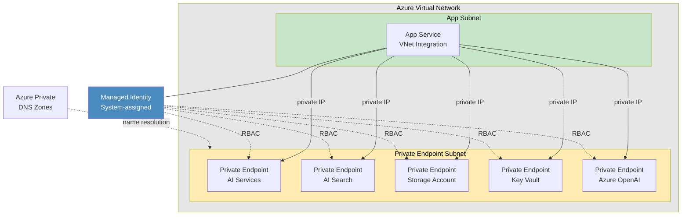

### Zero Trust Pattern for AI Services

| Layer | Implementation |
|---|---|
| **Network** | Private endpoints; disable public network access on all AI resources |
| **Identity** | Managed identity (system-assigned) — no API keys in code |
| **Data** | Customer-managed keys (CMK) for encryption at rest; TLS 1.2+ in transit |
| **Access Control** | Azure RBAC: `Cognitive Services User`, `Search Index Data Reader`, etc. |
| **Monitoring** | Diagnostic settings → Log Analytics; Azure Monitor alerts |
| **Secrets** | Key Vault for any required secrets; never store in app config |

### Key RBAC Roles for AI

| Role | Purpose |
|---|---|
| `Cognitive Services OpenAI User` | Call Azure OpenAI completions/embeddings APIs |
| `Cognitive Services User` | Call AI Services APIs (Vision, Language, etc.) |
| `Search Index Data Contributor` | Read/write search index data |
| `Storage Blob Data Reader` | Read blobs (for indexer data source) |
| `Key Vault Secrets User` | Read secrets from Key Vault |

### Key Exam Points

- **Managed identity** is the recommended authentication — use `DefaultAzureCredential` in code.
- `DefaultAzureCredential` tries (in order): environment → managed identity → Visual Studio → Azure CLI → Interactive.
- Private endpoints create a **network interface** in your VNet with a private IP for the AI service.
- Each private endpoint requires a **Private DNS Zone** for correct name resolution (e.g., `privatelink.cognitiveservices.azure.com`).
- Disable public network access: set `publicNetworkAccess: Disabled` on AI resources.
- **Customer-managed keys** require Key Vault with soft-delete and purge protection enabled.
- **Virtual network rules** and **IP firewall rules** can be used instead of (or with) private endpoints.
- **Diagnostic settings** should send to Log Analytics for auditing API calls.

### Exam Objectives

- *Plan and manage an Azure AI solution* — networking, authentication, key management
- *Implement security for Azure AI solutions* — managed identity, RBAC, private endpoints, CMK

### Relevant Labs

- Lab: Manage Azure AI Services security
- Lab: Configure private endpoints for Azure AI Services (if available)

---

## 10. Content Safety Pipeline

Azure AI Content Safety provides layered filtering for both inputs and outputs of generative AI applications.

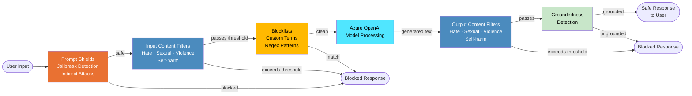

### Filter Severity Levels

| Category | Severity Levels | Action Options |
|---|---|---|
| **Hate** | Safe (0) · Low (2) · Medium (4) · High (6) | Allow, Filter, or Annotate at each level |
| **Sexual** | Safe (0) · Low (2) · Medium (4) · High (6) | Allow, Filter, or Annotate at each level |
| **Violence** | Safe (0) · Low (2) · Medium (4) · High (6) | Allow, Filter, or Annotate at each level |
| **Self-harm** | Safe (0) · Low (2) · Medium (4) · High (6) | Allow, Filter, or Annotate at each level |

### Content Safety Features

| Feature | Purpose |
|---|---|
| **Content Filters** | Severity-based filtering for 4 harm categories on both input and output |
| **Prompt Shields** | Detect jailbreak attempts and indirect prompt injection from documents |
| **Blocklists** | Custom term lists and regex patterns for domain-specific blocking |
| **Protected Material Detection** | Detect known copyrighted text in model output |
| **Groundedness Detection** | Verify model output is grounded in provided source documents |

### Key Exam Points

- Content filters are configured per **deployment** in Azure OpenAI — each deployment can have different filter settings.
- Default filter configuration blocks content at **Medium** severity and above.
- **Prompt Shields** are separate from content filters; they detect adversarial prompt manipulation.
- **Blocklists** support both exact match and regex patterns; up to 10,000 terms per list.
- The Content Safety API can be called **standalone** (not just through Azure OpenAI) for pre/post-processing.
- `annotations` in the API response show which filter triggered and at what severity.
- When a filter blocks content, the API returns a `finish_reason: "content_filter"` with a `content_filter_results` object.
- **Groundedness detection** compares model output against source documents to detect hallucinations.
- Configure filters via Azure OpenAI Studio → Deployments → Content Filters, or via REST API.

### Exam Objectives

- *Create solutions with Azure OpenAI* — content filter configuration, responsible AI
- *Implement responsible AI practices* — harm mitigation, content safety configuration

### Relevant Labs

- Lab: Configure content filters in Azure OpenAI
- Lab: Explore Azure AI Content Safety (if available)

---

## Quick Reference: Architecture Selection

| Scenario | Primary Architecture | Key Services |
|---|---|---|
| Chat with enterprise docs | RAG (#1) | Azure OpenAI + AI Search + Blob |
| Extract data from scanned forms | Document Processing (#3) | Document Intelligence |
| Enrich & search unstructured content | Enrichment Pipeline (#2) | AI Search + Skillset |
| Classify product images | Computer Vision (#4) | Custom Vision / AI Vision |
| Voice-enabled assistant | Speech (#5) + Conversational AI (#6) | Speech SDK + Bot Framework + CLU |
| FAQ chatbot | Conversational AI (#6) | Custom Question Answering + Bot |
| Multi-step task automation | Agentic AI (#8) | Assistants API + Function Calling |
| Secure production deployment | Secure AI (#9) | VNet + Private Endpoints + MI |
| Content moderation for GenAI | Content Safety (#10) | Content Filters + Prompt Shields |
| End-to-end GenAI project | AI Foundry (#7) | Hub + Project + Prompt Flow |

---

*Last updated: July 2025 — aligned with AI-102 exam objectives and Azure AI services GA features.*
